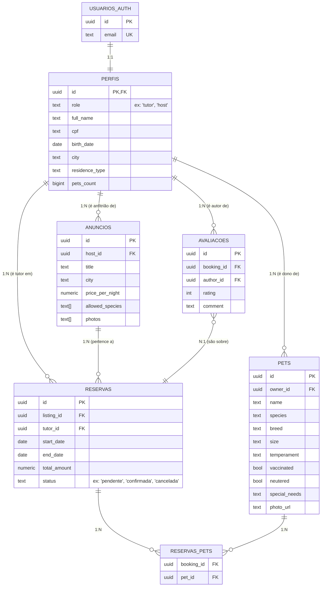

```mermaid
erDiagram
  USUARIOS_AUTH {
    uuid id PK
    text email UK
  }

  PERFIS {
    uuid id PK, FK
    text role "ex: 'tutor', 'host'"
    text full_name
    text cpf
    date birth_date
    text city
    text residence_type
    bigint pets_count
  }

  PETS {
    uuid id PK
    uuid owner_id FK
    text name
    text species
    text breed
    text size
    text temperament
    bool vaccinated
    bool neutered
    text special_needs
    text photo_url
  }

  ANUNCIOS {
    uuid id PK
    uuid host_id FK
    text title
    text city
    numeric price_per_night
    text[] allowed_species
    text[] photos
  }

  RESERVAS {
    uuid id PK
    uuid listing_id FK
    uuid tutor_id FK
    date start_date
    date end_date
    numeric total_amount
    text status "ex: 'pendente', 'confirmada', 'cancelada'"
  }

  RESERVAS_PETS {
    uuid booking_id FK
    uuid pet_id FK
  }

  AVALIACOES {
    uuid id PK
    uuid booking_id FK
    uuid author_id FK
    int rating
    text comment
  }

  %% --- Relacionamentos ---
  USUARIOS_AUTH ||--|| PERFIS : "1:1"

  PERFIS ||--o{ PETS : "1:N (é dono de)"
  PERFIS ||--o{ ANUNCIOS : "1:N (é anfitrião de)"
  PERFIS ||--o{ RESERVAS : "1:N (é tutor em)"
  PERFIS ||--o{ AVALIACOES : "1:N (é autor de)"

  ANUNCIOS ||--o{ RESERVAS : "1:N (pertence a)"

  AVALIACOES }o--|| RESERVAS : "N:1 (são sobre)"

  %% Relação N:N para Pets em Reservas
  RESERVAS ||--o{ RESERVAS_PETS : "1:N"
  PETS ||--o{ RESERVAS_PETS : "1:N"
```