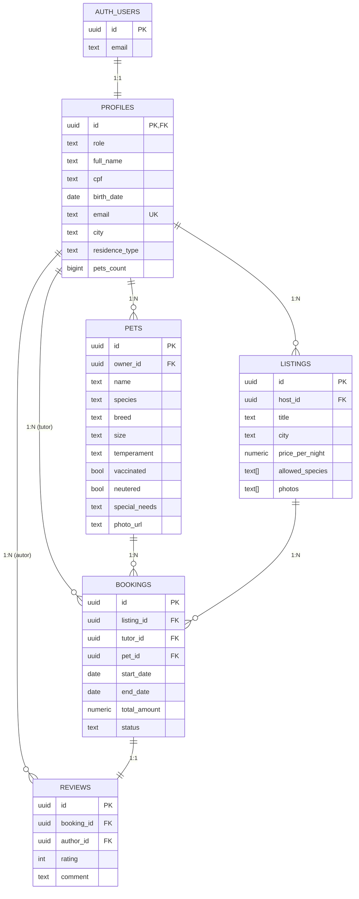

```mermaid
erDiagram
  AUTH_USERS {
    uuid id PK
    text email
  }

  PROFILES {
    uuid id PK, FK
    text role
    text full_name
    text cpf
    date birth_date
    text email UK
    text city
    text residence_type
    bigint pets_count
  }

  PETS {
    uuid id PK
    uuid owner_id FK
    text name
    text species
    text breed
    text size
    text temperament
    bool vaccinated
    bool neutered
    text special_needs
    text photo_url
  }

  LISTINGS {
    uuid id PK
    uuid host_id FK
    text title
    text city
    numeric price_per_night
    text[] allowed_species
    text[] photos
  }

  BOOKINGS {
    uuid id PK
    uuid listing_id FK
    uuid tutor_id FK
    uuid pet_id FK
    date start_date
    date end_date
    numeric total_amount
    text status
  }

  REVIEWS {
    uuid id PK
    uuid booking_id FK
    uuid author_id FK
    int rating
    text comment
  }

  AUTH_USERS ||--|| PROFILES : "1:1"
  PROFILES ||--o{ PETS : "1:N"
  PROFILES ||--o{ LISTINGS : "1:N"
  PROFILES ||--o{ BOOKINGS : "1:N (tutor)"
  PROFILES ||--o{ REVIEWS : "1:N (autor)"
  PETS ||--o{ BOOKINGS : "1:N"
  LISTINGS ||--o{ BOOKINGS : "1:N"
  BOOKINGS ||--|| REVIEWS : "1:1"
```
